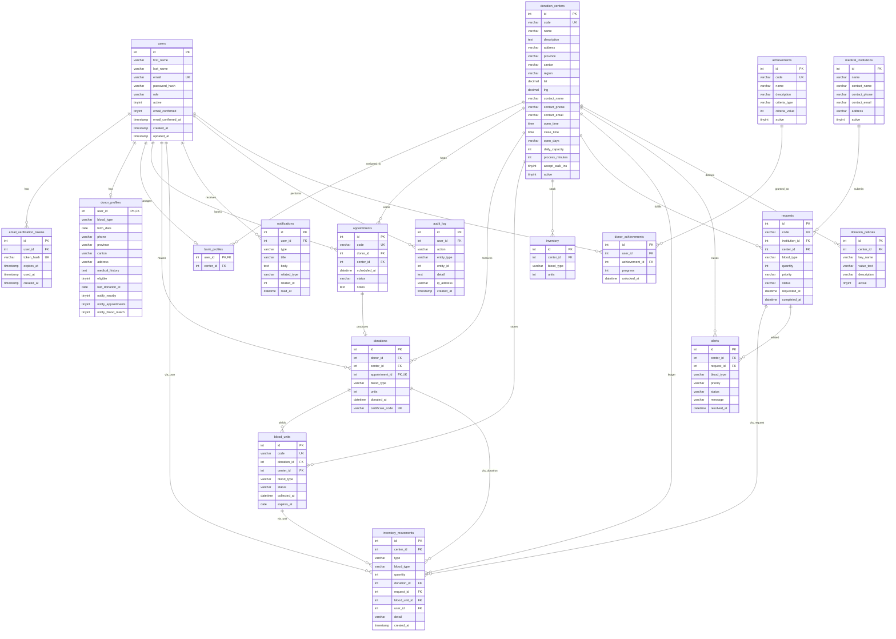

# Diagrama entidad-relación — Pulso Solidario

Esquema MySQL definido en [`01_init.sql`](./01_init.sql).  
Se renderiza automáticamente en GitHub, GitLab y en la vista previa de Markdown de Cursor/VS Code.

Aquí un link directo al diagrama visualizado desde [Mermaid.live](https://mermaid.live/view#pako:eNqtWEtz2zgM_isand1Mksau7Wt39tLZmV562cmMhiZhiWOKVEnKjTbpf1-Isp6mHo3jk00AJPAB-Aj6NaSKQbgPQf_FSaxJ-iwD_OQGtAne3j59Uq8BpISL6AyaHzkllisZWXUCaYJ9kBBzZfEWMCWVjjKtjlzAuNqByFNXKyWSxHDRxD2qsyhI2_FmaESM4bEEhj55fCdZpri0Ke5RKh-UOs3sP7BIlLEXi56kjdTtUqqiUyynYDxudNVScpqLsauugQI_Dy1aOIRSLMold94WHASbA7BnYazSc-5wecYFpYtKn54q9RQY1oOIuDSW27znloafOZjqhPyQcjtzREf_mAvMrVjqU5SqM9TZEsBi0CNQ-U3OnES1amXY-DJrd9GszLq4zlqWap46mTAww7iuCleAduqacFOndBhLqwSCWGDL6jDKlOCUu35jcOTSW-RS2YYhriu335Y54zYSKi7bBvRR6XSkbZBHCE04tGgA0bLuyK5kygaZDQNjUUlD3XNeqx_lBzs74Cz4_q1dOhNNE6KDI9fGRpKkcC0TZFTkeDP44dkwQ9L6pTSLkBeTa7FWorOd5bIonSPUIprX6xU9UyXRzbTOaKWQYupJmg1VImJ9WlQDsaPSPGM96e8ayfHrYRrdcqnMQoTrf3tAcps4hHoYdqJ6yThy15i_ZnGgTSiDe-vV7-z3byufv1X_2yLr5KiELDhwbZOo_OqphERJ37JWZy6pR0KxkGui6q4TxhAL0wkXXmxD0Qkveb7wFI_gMT-Iocuuqpvu76NYGbpmLyKJ3XgoRsXdK3NUqQIuJZYm1_no89Kyfi1nGm_f9fvUIcTAUM2zlv0nQX1_fjTEvSMYUJ4SgUhbz6KMfVFJixwwQja1dKSgarFr1n5PBCrDPiu_DdapUAYGgno_Z8NIYfoJYbh7EVGSEcpt0ZchZjgcmSjlMrdgfARHIbPRLyJO5UwxzYBNjfTnwWUtW4qqkuqST7Old7BZVnrTyfnI1I03_hRavRn2nd3kEu2YcsDcflhrUnE1ZWgCLBcDaq6PQnq2-ZDDkCXqarkihiV3zB-66qBrUarEqx8LCd8VneRdtmtid06PRE5xLKvuT4h6gLd13hkvb0tcRamLAZkKdyxxTcxUCQF0GLW7Y4bXdxNp-9yYT-6fuzzIUHNqMynfAG6HMD4G39LqZ45XSo9N21uIK-2VjObjEqUnH5d0pZkA72zke5rcmh9_MS0HYq6gL9H6RG07-aRTcykDe3WHzsyVl1fXe-GaCGVJcy4vk3odAzIkBm_9GCXOI7Pz4K14a3WcoBi5Mc9E5DiZ4O3gS49noJu8E_vv1hsfLd4MYNWK4eB5UKzwjYnuWe6p_lrCmTctxFd2zSv7tqBK1HwzLbh29Ph6EXRdvQzb1jvD8CzyjDHzbdV95H_o02CymJq9sKnw1Us8ADQiV6kL69Dzz8X78lad0GzjE-PAHPfxbmopl0LRUxfvcBXGmrNwb3UOqzAFjaMo_gyde8-hTfCc53CPXxkcSS7sc_gsS7OMyH-VSmtLrfI4CfdHIgz-qv5RuPzv3KiAZKC_qlzacL95-uz2CPev4Uu4f9ht7zb364ftdvf4sF0_3T-uwiLcf17fPe0e7r_gwsPjZvO0-b0K_3On3t_tUPtxs9ttt-v19st6swpxtsdb7J_qb2_37_fv_wHsHmGd) 

Este otro link es al playground interactivo de [Mermaid.live](https://mermaid.live/edit#pako:eNqtWMuO2zoM_RXD63TQdB6ZybYXd1MU6KabYgBDkRhbiCy5kpyOb2b-_dJy_Iz86GSySkRSIg_JIyqnkCoG4TYE_Q8nsSbpswzwkxvQJnh9_fRJnQJICRfRETTfc0osVzKy6gDSBNsgIebC4jVgSiodZVrtuYBxtR2Rh65WSiSJ4ayJe1RnUZC2483QiBjDYwkMffL4TrJMcWlT3KNU3il1mNl_YJEoY88WPUkbqdulVEWnWE7BeNzoqqXkMBdjV10DBX4cWrRwCKVYlEvuvC04CDYHYM_CWKXn3OHyiAtKF5U-PVTqKTCsBxFxaSy3ec8tDb9zMNUJ-S7lduaIjv4-F5hbsdSnKFVHqLMlgMWgR6Dymxw5iWrVyrDxZdburFmZdXGdtSzVPHUyYWCGcV0UrgDt1DXhpk7pMJZWCQSxwJbVYZQpwSl3_cZgz6W3yKWyDUNcVm6_LXPGbSRUXLYN6L3S6UjbII8QmnBo0QCiZd2RXcmUDTIbBsaikoa655yqH-UHOzvgLPjxrV06Ek0TooM918ZGkqRwKRNkVOR4M_jp2TBD0vqjNIuQF5NLsVais53lsiidI9QimpfrFT1TJdHNtM5opZBi6kmaDVUiYn1aVAOxo9I8Yz3pW43k-PUwjW65VGYhwvV_PSC5TRxCPQw7Ub1kHLlrzF-zONAmlMG9dfI7--Pbyudv1f-2yDo5KiELdlzbJCq_eiohUdK3rNWRS-qRUCzkmqi664QxxMJ0woUX21B0wkueLzzFI3jMd2Losqvqpvv7KFaGrtmLSGI37opRcffKHFWqgEuJpcllPvq8tKxfy5nG23f9PnUIMTBU86xl_0lQ358fDXHvCAaUp0Qg0tazKGNfVNIiB4yQTS0dKaha7Jq13xOByrDPym-DdSqUgYGg3s_ZMFKYfkIY7l5ElGSEclv0ZYgZDkcmSrnMLRgfwVHIbPSHiEM5U0wzYFMj_XlwWcuWoqqkuuTTbOkdbJaV3nRyPjJ1440_hVZvhn1nN7lEO6YcMLcf1ppUXE0ZmgDLxYCa66OQnm0-5DBkibpaLohhyR3zl6466FqUKvHq50LCd0UneZftmtid0yORUxzLqvsToh7gbZ13xsvrEldR6mJApsIdS1wTM1VCAB1G7e6Y4fXdRNo-N-aT-_cuDzLUnNpMyleA2yGMj8G3tPqd45XSY9P2FuJKeyWj-ThH6cnHOV1pJsA7G_meJtfmx19My4GYK-hztD5R204-6dRcysBe3KEzc-X51fVeuCZCWdKcy8ukXseADInBWz9GiePI7Dx4K15bHQcoRm7MIxE5TiZ4O_jS4xnoJu_E_rv1ykeLNwNYtWI4eO4UK3xjonuWe6q_lnDmTQvxlV3zyr4uqBI130wLrh09vp4FXVfPw7b1zjA8izxjzHxbdR_5H_o0mCymZi9sKnz1Eg8AjchV6sI69Pxz8b68VSc02_jEODDHfbybWsqlUPTQxTtchbHmLNxancMqTEHjKIo_Q-fec2gTPOc53OJXBnuSC_scPsvSLCPyl1JpbalVHifhdk-EwV_VPwrn_50bFZAM9FeVSxtu149ui3B7Cl_C7ZeH9c3D0-fNw5f7zd3T5vZpFRbh9m5983S7uds83j7db9brh9uHt1X4nzv0883j5n4V4jSP99b36o9u93_32__Uv17D)

## Diagrama completo

## Cardinalidades (resumen)

| Relación | Tipo |
|----------|------|
| `users` → `donor_profiles` / `bank_profiles` | 1 : 0..1 |
| `bank_profiles` → `donation_centers` | N : 1 |
| `users` (donor) ↔ `donation_centers` vía `appointments` | N : M |
| `appointments` → `donations` | 0..1 : 1 (única por cita) |
| `donations` → `blood_units` | 1 : N |
| `donation_centers` → `inventory` | 1 : N (único por `blood_type`) |
| `medical_institutions` → `requests` | 1 : N |
| `achievements` ↔ `users` vía `donor_achievements` | N : M |

## Valores de estado / enums (CHECK)

| Campo | Valores |
|-------|---------|
| `users.role` | `donor`, `bank`, `admin` |
| `appointments.status` | `pending`, `confirmed`, `completed`, `cancelled`, `no_show` |
| `blood_units.status` | `available`, `assigned`, `discarded`, `expired` |
| `requests.priority` / `alerts.priority` | `low`, `normal`, `critical` |
| `requests.status` | `pending`, `assigned`, `in_transit`, `completed`, `cancelled` |
| `inventory_movements.type` | `receipt`, `assignment`, `adjustment`, `discard` |
| `alerts.status` | `active`, `resolved` |
| `*.blood_type` | `O+`, `O-`, `A+`, `A-`, `B+`, `B-`, `AB+`, `AB-` |

**Notas**

- Los tipos de sangre son un enum (`CHECK`), no una entidad.
- FKs opcionales en el SQL (`NULL`): `donations.appointment_id`, `requests.center_id`, FKs de `inventory_movements`, `alerts.request_id`, `donation_policies.center_id` (NULL = política global), `audit_log.user_id`.
- Umbrales de inventario se calculan o salen de `donation_policies`; no se guardan como color.
- `inventory_movements` es append-only: cada cambio de stock deja un movimiento.
